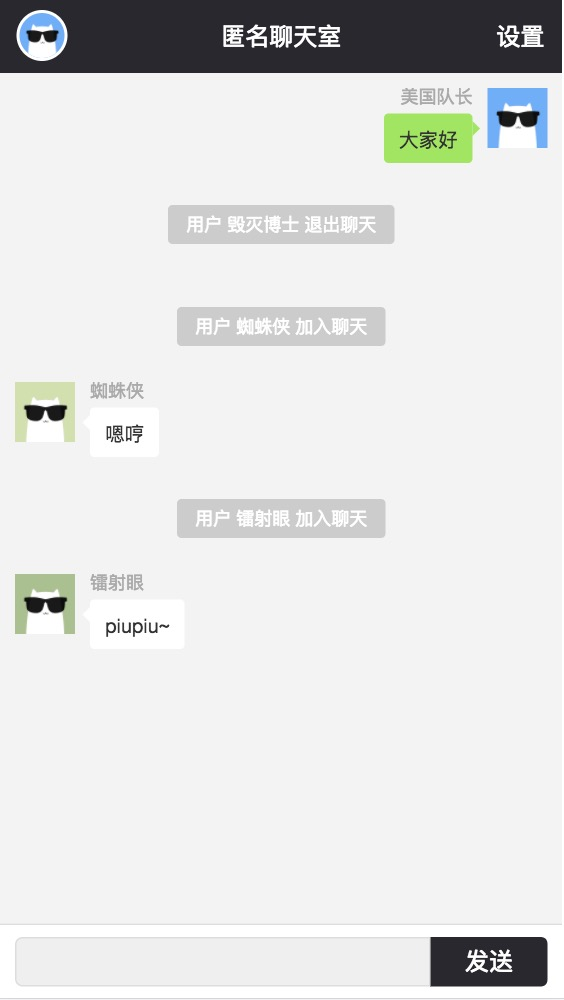

# vue-node-socket

> A Vue.js project


## 安装依赖
```
npm install
```

## 启动服务端
```
npm run server
```

## 启动客户端(开发)
```
npm run dev
```

## 打包
```
npm run build
```

## 访问开发版地址
```
http://localhost:8080/
```

## 访问部署版地址
```
http://localhost:9080/
```

注意 调试的时候 请把 `room.vue` 的地址换成本地

## 预览


